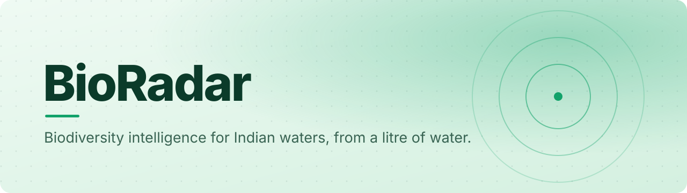

<a id="top"></a>

<p align="center">
  
</p>

<p align="center">
  
  
  
  
  
  
  
</p>

<p align="center">
  <b>From one litre of water to a species list, an invasion forecast and a record nobody can quietly edit.</b><br>
  BioRadar turns raw eDNA sequencing reads into biodiversity intelligence a forest officer can act on,<br>
  in English or Hindi, without catching, seeing or disturbing a single organism.
</p>

<p align="center">
  <a href="docs/assets/intro.mp4"><b>Watch the intro</b></a> ·
  <a href="#quick-start"><b>Quick start</b></a> ·
  <a href="#how-it-works"><b>How it works</b></a> ·
  <a href="#the-intelligence-layer"><b>Intelligence layer</b></a> ·
  <a href="#validation"><b>Validation</b></a> ·
  <a href="docs/RUNNING.md"><b>Run guide</b></a>
</p>

<br>

<details>
<summary><b>Table of contents</b></summary>

- [Why it matters](#why-it-matters)
- [Every requirement, met](#every-requirement-met)
- [Features](#features)
- [The control panel](#the-control-panel)
- [The intelligence layer](#the-intelligence-layer)
- [How it works](#how-it-works)
- [Quick start](#quick-start)
- [Validation](#validation)
- [Bring your own data](#bring-your-own-data)
- [Built with](#built-with)
- [Project layout](#project-layout)
- [FAQ](#faq)
- [Documentation](#documentation)
- [My role](#my-role)
- [Acknowledgements](#acknowledgements)

</details>

## Why it matters

A litre of estuary water carries DNA from everything living in it: shed skin, scales, mucus, waste.
Sequence it and you can list the species present without trapping or disturbing any of them. It is the
cheapest biodiversity survey method there is.

The hard part is what comes back from the sequencer: millions of short text strings. Turning those into
*"an invasive tilapia is establishing in Vembanad Lake, and here is the evidence"* takes a bioinformatics
pipeline, a curated reference database and somewhere to put the answer that a decision-maker can read.
**BioRadar is that whole path, end to end.**

## Every requirement, met

| SIH25042 needs | BioRadar delivers |
|---|---|
| Species identification from eDNA reads | A QIIME 2 pipeline (cutadapt, DADA2 or vsearch, naive Bayes) against an India-curated COI reference of 33,611 sequences and 8,020 species |
| Understanding of Indian waters | 43% of the reference comes from Indian records; six validated coastal and lake baselines |
| Invasive-species detection and risk | Establishment-risk model, streaming anomaly alerts and Indian legal mapping per species |
| Where it is heading | Biodiversity forecast and hydro-corridor spread prediction |
| Results people can trust | SHA-256 of every artifact, chained per sample into a Merkle ledger; byte-identical output across runs |
| Usable by non-specialists | A bilingual (English / हिन्दी) dashboard and an auto-written executive brief |

## Features

- **Reads your data and configures itself.** Marker, primers, read length and quality encoding are
  detected from the reads. You never type a truncation length.
- **Refuses to waste your time.** Pre-flight catches unusable data in about a second, instead of
  failing 40 minutes into a run.
- **Recovers awkward datasets.** Data DADA2 cannot denoise is routed to vsearch OTU clustering rather
  than rejected, and reversed R1/R2 mates are detected and swapped.
- **Names species against an India-curated reference.** Audited for cross-order collisions, with the
  India/global split recorded per phylum.
- **Proves the result was not altered.** A Merkle ledger over every artifact. Two independent runs
  produce byte-identical output.
- **Speaks to the field.** Interactive map, bilingual interface, Darwin Core Archive export and
  multi-channel alerts.

<p align="right"><a href="#top">Back to top ↑</a></p>

## The control panel

A single-page app on `http://localhost:8080`, bilingual, with a light eco-green theme and a dark theme.

| View | What you do there |
|---|---|
| **Home** | The story, the science and quick jumps into the tools |
| **Analyze** | Drop a folder of paired-end FASTQ. BioRadar shows what it detected, then runs |
| **Monitor** | Every pipeline stage in real time, with live logs and progress |
| **Results** | Species table with read counts and confidence, site map, composition charts, engine output |
| **Compare** | Shannon, Simpson and richness across sites and sampling rounds (the *Time Machine*) |
| **Alerts** | Invasive-species anomalies and biosecurity flags, with severity and reasoning |
| **Settings** | Pipeline configuration, theme and language |

## The intelligence layer

Built on top of the species table, each engine answers one question a decision-maker would ask.

| Engine | Answers |
|---|---|
| **Biodiversity weather forecast** | Where is diversity heading over the next rounds? |
| **Multi-agent stakeholder debate** | What would an ecologist, an economist and a fisher each conclude? |
| **Zero-shot taxonomy classifier** | Can a sequence with no reference match still be flagged? |
| **Streaming anomaly alerts** | Is this reading a real departure from the site's baseline? |
| **Sentinel-2 change detection** | Did the habitat around this site physically change? |
| **Invasive-species risk** | How likely is this alien species to establish here? |
| **Extinction-risk viability** | What is the trajectory of a threatened species under each scenario? |
| **Hydro-corridor spread** | Which downstream sites are next, and when? |
| **Sampling-site optimiser** | Where should the next survey go to learn the most? |
| **PINN source finder** | Where upstream did this eDNA signal come from? |
| **Explainable AI** | Why did the model decide that? |
| **Field verification (TFLite)** | Does a field photo corroborate the eDNA call? |
| **Executive brief (NLG)** | Write the page a decision-maker will actually read. |
| **Biodiversity NFT receipt** | Can a sponsor hold a tamper-proof record of a survey? |

Mathematics and implementation notes: [docs/ADVANCED_FEATURES.md](docs/ADVANCED_FEATURES.md).

<p align="right"><a href="#top">Back to top ↑</a></p>

## How it works

```text
FASTQ reads
   │  pre-flight      quality, primers, orientation, truncation
   │  cutadapt        remove primer sequences
   │  DADA2 / vsearch reads → amplicon sequence variants
   │  naive Bayes     variants → species, against the India-curated reference
   │  normalizer      QIIME 2 output → BioRadar's frozen data contract
   │  SHA-256         chain-of-custody Merkle ledger
   ▼  intelligence engines: forecast, risk, spread, anomalies, executive brief
species report · map · forecast · tamper-evident record
```

1. **Pipeline.** The bioinformatics layer ships as a Docker image so a run is reproducible on any machine.
2. **Contract.** Everything downstream codes against one frozen schema, so engines never parse raw taxonomy strings.
3. **Intelligence and provenance.** Engines read the normalized table; every artifact is hashed into the ledger.

## Quick start

> Needs Docker Desktop, about 40 GB of free disk (the scientific image is 11.7 GB) and 8 GB of RAM.
> Set Docker's memory to 6 GB or more, or DADA2 will be killed mid-run.

```bash
docker pull ghcr.io/omtawde09/bioradar-pipeline:v1.0
git clone https://github.com/omtawde09/BioRadar.git
cd BioRadar
./scripts/setup.sh              # Git Bash on Windows
docker compose up app
```

Open **http://localhost:8080**. Step-by-step with the Docker Desktop GUI: [docs/RUNNING.md](docs/RUNNING.md).

The bundled demo is 12 samples from 6 coastal sites, sampled twice, and takes about 3 minutes. It is
**simulated and labelled as such**: every read comes from a real COI reference sequence, but which
species occur where is invented. See [docs/DEMO_DATASET.md](docs/DEMO_DATASET.md).

## Validation

Measured on an *in silico* mock community with known ground truth.

| Measure | Result |
|---|---|
| Detections recovered | **80 of 80**, at exact read counts |
| False positives | **0** |
| Named species | **12 of 12**, 0 unnamed records |
| Invasive growth between rounds | **1.9×**, so the Time Machine has real change to detect |
| Unit tests | **76**, about 8 s, no Docker needed |
| Integration checks | **15** |

The validation also caught a **mislabelled record in the public NCBI reference data**: two sequences one
base apart, assigned to species in different taxonomic orders. Details in [docs/DEMO_DATASET.md](docs/DEMO_DATASET.md).

```bash
python -m pytest tests/ -q          # 76 tests
./ci/check_integration.sh --fast    # integration checks, skipping Docker
```

<p align="right"><a href="#top">Back to top ↑</a></p>

## Bring your own data

BioRadar needs paired-end FASTQ files, two per sample.

```text
MySample01_S1_L001_R1_001.fastq.gz
MySample01_S1_L001_R2_001.fastq.gz
```

Other layouts such as `SRR123_1.fastq.gz` are recognised and renamed. For the map, drop a `samples.csv`
next to the reads:

```csv
sample_id,site_id,latitude,longitude,collected_at
MySample01,MANDOVI,15.4989,73.8278,2026-01-15
```

Then **Analyze → Select folder → Upload & analyze**. A run takes 3 to 40 minutes depending on depth.

## Built with

| Layer | Technology |
|---|---|
| Bioinformatics | QIIME 2, DADA2, cutadapt, vsearch, Snakemake, packaged in Docker |
| Backend | Python 3.10+, standard-library HTTP server |
| AI and analytics | scikit-learn, NumPy, SciPy, PINN and PVA models, TFLite, LLM agents |
| Provenance | SHA-256 Merkle ledger, Solidity receipt contract |
| Web app | Vanilla-JS single-page app, Leaflet, custom charts, EN/HI i18n |
| Landing page | React 18, TypeScript, Tailwind CSS, Framer Motion, Lenis |

## Project layout

```text
bioradar/            integration layer: webapp, contract, preflight, pipeline runner, ledger, exports
  ai/                forecast, debate, zero-shot, IAS risk, PVA, PINN, spread, optimiser, XAI, NLG
  analytics/         diversity forecasting and streaming anomaly detection
  satellite/         Sentinel-2 change detection
  blockchain/        receipt contract and generative-art engine
src/                 landing page (React + TypeScript + Tailwind)
bioradar-pipeline/   Layer-1 bioinformatics image
data/  docs/  tests/  ci/
```

## FAQ

<details>
<summary><b>Everything came back "Unassigned". Is it broken?</b></summary>
<br>
No. The pipeline worked; the reference simply does not cover those organisms. That is a real result,
and unassigned rows keep their read counts because they are often the most interesting ones.
</details>

<details>
<summary><b>Why did DADA2 fail?</b></summary>
<br>
Almost always memory. Raise Docker's limit to 6 to 8 GB.
</details>

<details>
<summary><b>Is the demo data real field data?</b></summary>
<br>
No, and it must not be presented as such. Classifications are genuine, but the site occupancy is simulated.
</details>

## Documentation

| Document | Covers |
|---|---|
| [docs/RUNNING.md](docs/RUNNING.md) | Every way to run the system |
| [docs/TESTING.md](docs/TESTING.md) | Verifying each layer |
| [docs/CONTRACTS.md](docs/CONTRACTS.md) | Data formats between components |
| [docs/PIPELINE.md](docs/PIPELINE.md) | The bioinformatics itself |
| [docs/ADVANCED_FEATURES.md](docs/ADVANCED_FEATURES.md) | The advanced engines, logic and mathematics |
| [docs/DESIGN.md](docs/DESIGN.md) | Design system: tokens, components, accessibility |

## My role

BioRadar was a team entry for Smart India Hackathon 2026 (SIH25042) from K.C. College of Engineering,
Thane, maintained by [Om Tawde](https://github.com/omtawde09). I helped build the platform, including
the species-to-intelligence layer and the validation that surfaced the mislabelled NCBI record.

## Acknowledgements

Apache-2.0, see [LICENSE](LICENSE). The Layer-1 pipeline derives from the **eDNA-Container App** by
Wheeler, Brancalion, Kumar and Lintermans (NSW Department of Primary Industries),
[doi:10.3390/app14062641](https://doi.org/10.3390/app14062641). Species assignment uses MIDORI2 and NCBI
data; QIIME 2 is BSD 3-Clause. Full attribution in [NOTICE](NOTICE).

<p align="center"><sub>Built for the Smart India Hackathon 2026 · SIH25042</sub></p>
